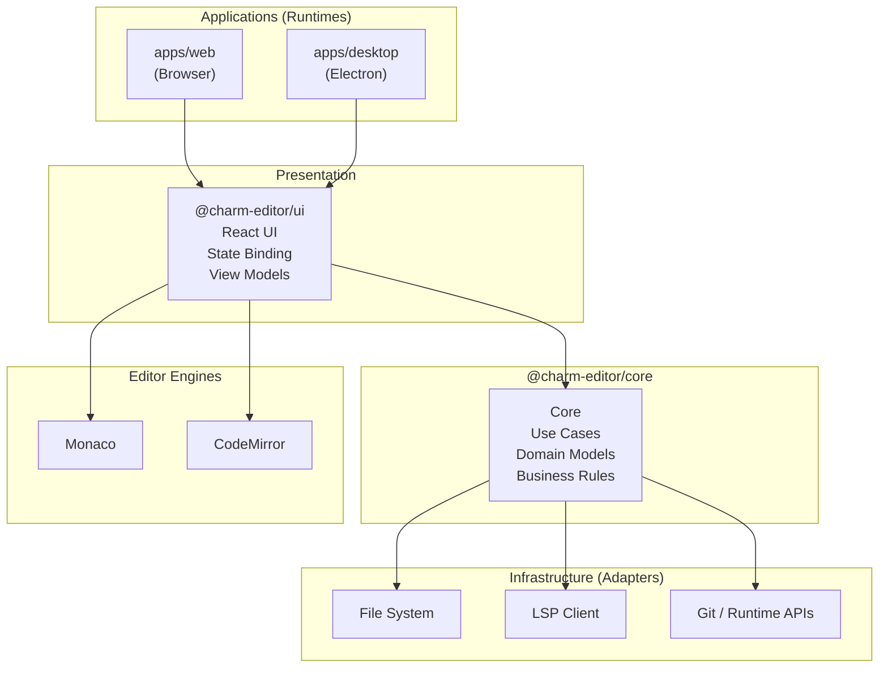

# Charm Editor – Architectural Blueprint

## 1. Vision

Charm Editor is a modular, cross-platform shader IDE.
The architecture is designed to:

- Support Web + Electron without code duplication
- Isolate business logic from UI and runtime
- Allow future expansion (Live Share, WASM, Mobile, Plugins)

The system follows **Clean Architecture + Ports & Adapters**.

---

## 2. High-Level Architecture



---

## 3. apps/\* (Runtimes)

### apps/web

**Responsibility**

- Browser-only runtime
- No Electron, no Node APIs

**Contains**

- React bootstrap
- WebGPU / WebGL renderer
- Web FS implementation (OPFS / File Picker)

**Depends on**

- @charm-editor/ui
- @charm-editor/core
- @charm-editor/editor-engine
- @charm-editor/file-system (Web impl)

---

### apps/desktop

**Responsibility**

- Electron runtime (Native IDE)

```

apps/desktop
├─ main
│  ├─ main.ts        # Electron main process
│  └─ preload.ts    # Secure IPC bridge
├─ renderer          # React + Vite app
└─ package.json

```

**Rules**

- main/ NEVER imports React
- renderer NEVER imports electron directly
- Communication only via preload IPC

---

## 4. @charm-editor/core (Pure Domain)

**Golden Rule**

> ❌ No React  
> ❌ No DOM  
> ❌ No Electron  
> ❌ No fs / process  
> ✅ Pure TypeScript

### Structure

```

core/
├─ domain        # Entities, Value Objects
├─ app           # Use Cases
├─ infra         # Interfaces only (Ports)
└─ presentation  # View Models (NO React)

```

### Examples

- domain:
  - ShaderDocument
  - ShaderStage
- app:
  - CompileShaderUseCase
  - OpenWorkspaceUseCase
- infra (interfaces):
  - FileSystem
  - LspClient
  - SnapshotStore

---

## 5. @charm-editor/editor-engine

### Goal

Abstract text editing away from Monaco / CodeMirror.

### Structure

```

editor-engine/
├─ core
│  ├─ EditorAdapter.ts
│  ├─ TextModel.ts
│  └─ Cursor.ts
├─ engines
│  ├─ monaco
│  └─ code-mirror
└─ index.ts

```

### Rule

UI talks ONLY to `EditorAdapter`.

This allows:

- CRDT sync
- Headless editor
- Engine swapping

---

## 6. @charm-editor/lsp-client

### Responsibility

Unified LSP communication layer.

### Features

- Transport abstraction:
  - stdio (Electron)
  - socket / wasm (Web)
- Typed JSON-RPC messages
- No dependency on Monaco

### Depends on

- @charm-editor/shared-types

---

## 7. glsl_analyzer (Zig)

### Role

Single source of truth for GLSL intelligence.

### Modes

- CLI (format / parse)
- LSP server (stdio / socket)
- Future: WASM

### Contract

- Communicates ONLY via LSP
- Editor never parses GLSL itself

---

## 8. @charm-editor/file-system

### Responsibility

Abstract file access.

### Interface

```ts
interface FileSystem {
  readFile(path: string): Promise<string>;
  writeFile(path: string, content: string): Promise<void>;
  watch(path: string): () => void;
}
```

### Implementations

- ElectronFileSystem
- WebFileSystem

---

## 9. Collaboration (Future)

### Engine

- CRDT-based (Automerge)

### Scope

- TextModel sync
- Cursor sync
- Preview state sync

### Isolation

All collaboration logic lives in:

```
@charm-editor/collaboration
```

No UI logic inside.

---

## 10. Data Flow Example (Edit → Compile)

```
User Types
  ↓
EditorAdapter
  ↓
TextModel
  ↓
CompileShaderUseCase
  ↓
LspClient
  ↓
glsl_analyzer
  ↓
Diagnostics
  ↓
UI Problems Panel
```

---

## 11. Non-Negotiable Rules

1. core must stay pure
2. UI never talks to infra directly
3. Electron APIs only in apps/desktop/main
4. Monaco is an implementation detail
5. glsl_analyzer is the only GLSL brain

---

## 12. Phase Execution Order

### Phase 1

- EditorAdapter + Monaco
- LSP stdio integration
- Basic WebGPU preview

### Phase 2

- FileSystem abstraction
- Workspace + Includes
- Problems panel

### Phase 3

- Snapshots + Thumbnails
- GPU profiler
- Resource explorer

### Phase 4

- Live Share
- Marketplace
- Remote preview

---

## End

This blueprint is intentionally strict.
Breaking rules early creates technical debt that kills IDE-scale projects.
