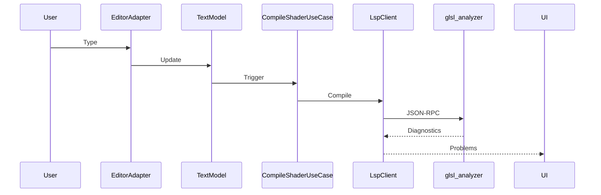

# Data Flows

## Edit → Compile

```mermaid
sequenceDiagram
User ->> EditorAdapter: Type
EditorAdapter ->> TextModel: Update
TextModel ->> CompileShaderUseCase: Trigger
CompileShaderUseCase ->> LspClient: Compile
LspClient ->> glsl_analyzer: JSON-RPC
glsl_analyzer -->> LspClient: Diagnostics
LspClient -->> UI: Problems
```
